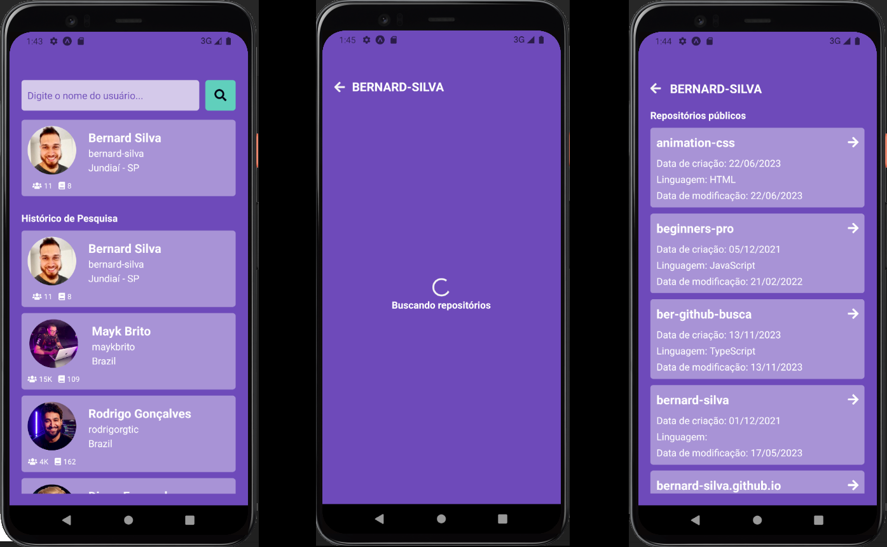

# Challenge: App to search on GitHub

<h6> Não fala inglês? <a href="https://github.com/bernard-silva/github-search-react-native-ts/blob/main/README-pt-br.md">Clique aqui</a> para ver essa página em português.<h6>

**Objective of the challenge**: Implement a search page that brings user data from GitHub and when clicking on the photo returns more details and a list of your repositories, where when tapping on one of them you should be directed to the repository on the GitHub website . Also display a menu with the history of searched users.

### Preview

<p align="center">
   
</p>

### Attention point

To prevent the GitHub API from being requested for each piece of information entered in the search input, the React Query library was used together with Zustand and Async Storage, to fetch previously searched data from the application cache, improving performance.

### Tools used

- <a href="https://reactnative.dev/" target="_blank">React Native (Expo)</a>
- <a href="https://www.typescriptlang.org/" target="_blank">TypeScript</a>
- <a href="https://axios-http.com/" target="_blank">Axios</a>
- <a href="https://styled-components.com/" target="_blank">Styled Components</a>
- <a href="https://tanstack.com/query/latest" target="_blank">React Query</a>
- <a href="https://reactnavigation.org/" target="_blank">React Navigation</a>
- <a href="https://zustand-demo.pmnd.rs/" target="_blank">Zustand</a>

### Why the tools?

- **Performance**: the marriage of **React Query + Zustand** allows for a more performative use of the application since with React Query it is possible to have more flexible management of server states when dealing with the API, using so the device cache for recent searches and Zustand for data persistence in Async Storage.
- **Customizable styling**: **Styled Components**
  allows you to write CSS styles inside JavaScript, turning them into components and
  improving code architecture and maintenance.
- **API consumption**: with axios we make HTTP requests in applications
  web, offering advanced features for efficient communication with
  servers.

### How to execute?

> You need to have the data manager
> packages/dependencies <a href="https://classic.yarnpkg.com/" target="_blank">yarn</a> in
> your machine and a device emulator (Android or iOS) or scan the QR Code generated on your cell phone with the Expo GO app

```
git clone https://github.com/bernard-silva/github-search-react-native-ts.git && cd github-search-react-native-ts
```

- Navigate to the project root
- Install dependencies with `yarn install`
- Run the project with `yarn start`
- Open the emulator by typing the letter `a` or scanning through the Expo GO app
